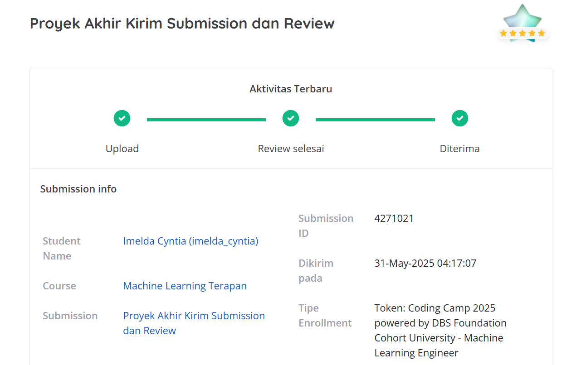
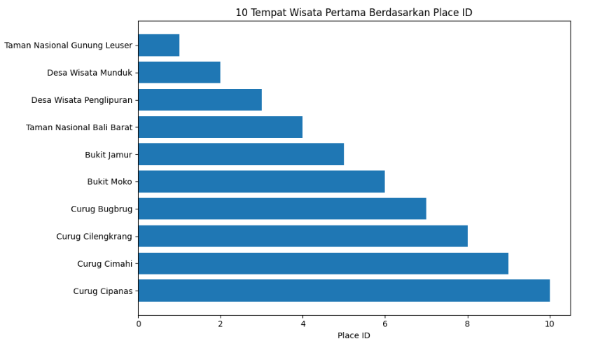
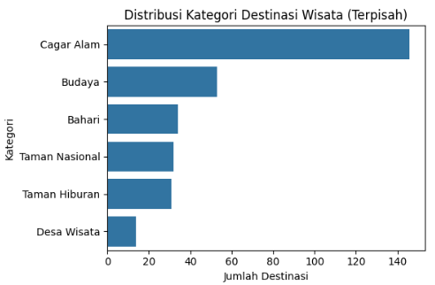
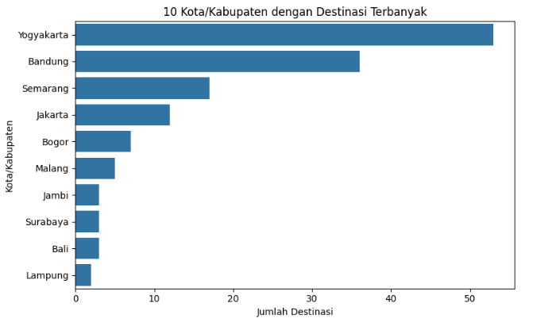
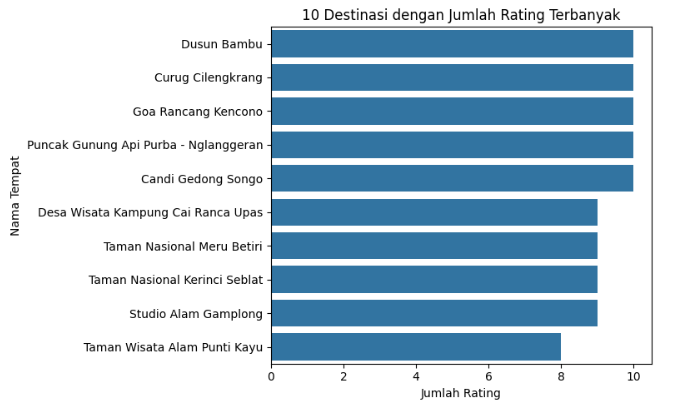
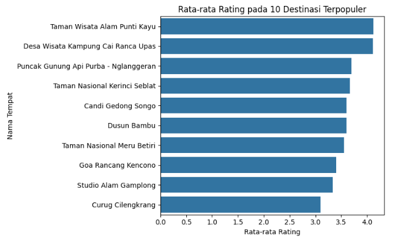
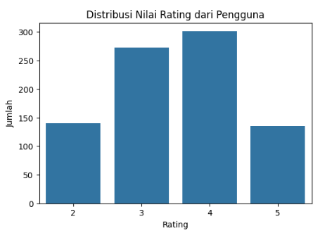
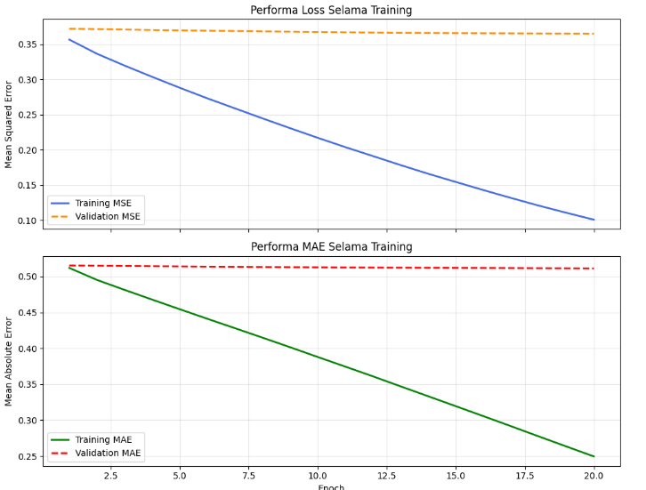

# Laporan Proyek Machine Learning - Imelda Cyntia




## Project Overview

### Latar Belakang

Indonesia memiliki potensi besar dalam pengembangan ekowisata berkelanjutan berkat kekayaan alam dan budaya yang melimpah. Namun, implementasi kebijakan ekowisata masih menghadapi tantangan seperti infrastruktur yang kurang memadai, partisipasi masyarakat lokal yang rendah, dan dampak lingkungan negatif. Studi oleh Idrus et al. (2024) menunjukkan bahwa meskipun ada komitmen pemerintah untuk mempromosikan ekowisata, berbagai hambatan tersebut masih menjadi tantangan signifikan dalam implementasinya.

Di sisi lain, pemanfaatan teknologi digital seperti sistem rekomendasi terbukti mampu meningkatkan efisiensi pencarian informasi wisata serta mendorong keterlibatan pengguna secara personal. Adopsi teknologi digital dalam promosi pariwisata dapat meningkatkan visibilitas destinasi dan pengalaman wisatawan, khususnya dalam konteks lokal. Hal ini menunjukkan bahwa integrasi sistem rekomendasi dalam promosi ekowisata Indonesia menjadi solusi potensial untuk meningkatkan distribusi kunjungan wisata dan mendorong pariwisata berkelanjutan.

### Daftar Referensi

Idrus, S. H., Jaya, L. M. G., Yusuf, M., & Rijal, M. (2024). Evaluation of the Implementation of Ecotourism-Based Tourism Policies in Indonesia: Challenges and Opportunities. Riwayat: Educational Journal of History and Humanities, 7(4), 2589–2597. https://doi.org/10.24815/jr.v7i4.41367

## Business Understanding

### Problem Statements

1. Banyak wisatawan tidak memiliki akses yang cukup terhadap informasi destinasi ekowisata yang sesuai dengan minat atau preferensinya.

2. Destinasi ekowisata lokal di Indonesia belum terekspos secara luas di platform digital, sehingga kurang dikenal oleh wisatawan.

3. Belum tersedia sistem rekomendasi yang memanfaatkan preferensi pengguna secara personal dan terintegrasi dengan data lokal Indonesia, khususnya dalam domain ekowisata.

### Goals

1. Mengembangkan sistem rekomendasi destinasi ekowisata berbasis data yang sesuai dengan preferensi pengguna.

2. Meningkatkan visibilitas destinasi-destinasi ekowisata lokal di Indonesia melalui teknologi digital.

3. Mendukung pengembangan pariwisata yang berkelanjutan dengan memberikan saran destinasi yang lebih personal dan relevan.

### Solution Approach

Untuk mencapai tujuan di atas, sistem akan dikembangkan dengan mengimplementasikan lebih dari satu pendekatan rekomendasi yang saling melengkapi:

1. Content-Based Filtering
   Content-Based Filtering menganalisis karakteristik dari destinasi wisata yang disukai atau dipilih pengguna, seperti kategori dan kota. Sistem kemudian merekomendasikan destinasi lain yang memiliki fitur serupa berdasarkan kemiripan kontennya.

2. Collaborative Filtering
   Membangun sistem berdasarkan penilaian atau rating dari pengguna lain. Sistem ini akan menyarankan destinasi yang disukai oleh pengguna dengan preferensi yang mirip, meskipun belum pernah dikunjungi oleh pengguna tersebut.

## Data Understanding

Dataset yang digunakan dalam proyek ini berjudul **[Indonesia’s Ecotourism Dataset](https://www.kaggle.com/datasets/farazbeniqnomf/indonesiaecotourism))** dan tersedia di platform Kaggle. Dataset ini dikembangkan untuk mendukung pengembangan sistem rekomendasi berbasis ekowisata di Indonesia. Terdapat tiga file utama yang digunakan, yaitu: `eco_place.csv`, `eco_event.csv`, dan `eco_rating.csv`.

### 1. eco\_place.csv (Data Destinasi Wisata)

File ini berisi informasi tentang tempat-tempat wisata alam dan ekowisata di Indonesia, termasuk deskripsi, kategori, harga tiket, rating, lokasi, dan dokumentasi visual.

* **Jumlah data**: 182 baris
* **Jumlah kolom**: 13
* **Missing value**: Terdapat missing value pada `gallery_photo_img2` (2 baris) dan `gallery_photo_img3` (77 baris)

| No | Nama Kolom             | Tipe Data | Keterangan                                 |
| -- | ---------------------- | --------- | ------------------------------------------ |
| 0  | `place_id`             | int64     | ID unik untuk setiap tempat wisata         |
| 1  | `place_name`           | object    | Nama tempat wisata                         |
| 2  | `place_description`    | object    | Deskripsi tempat                           |
| 3  | `category`             | object    | Kategori tempat wisata (Alam, Budaya, dsb) |
| 4  | `city`                 | object    | Kota atau kabupaten tempat wisata          |
| 5  | `price`                | object    | Harga tiket masuk (dalam teks)             |
| 6  | `rating`               | float64   | Rata-rata rating dari pengunjung           |
| 7  | `description_location` | object    | Deskripsi lokasi                           |
| 8  | `place_img`            | object    | Link utama gambar tempat                   |
| 9  | `gallery_photo_img1`   | object    | Link gambar galeri 1                       |
| 10 | `gallery_photo_img2`   | object    | Link gambar galeri 2                       |
| 11 | `gallery_photo_img3`   | object    | Link gambar galeri 3                       |
| 12 | `place_map`            | object    | Link lokasi peta (embed maps)              |

### 2. eco\_event.csv (Data Event Wisata)

File ini berisi informasi tentang event atau kegiatan wisata yang diadakan di destinasi ekowisata tertentu. Data ini bermanfaat untuk menambah konteks dan nilai tambah pada sistem rekomendasi, terutama dalam hal promosi event spesial.

* **Jumlah data**: 6 baris
* **Jumlah kolom**: 6
* **Missing value**: Tidak ada

| No | Nama Kolom    | Tipe Data | Keterangan                                     |
| -- | ------------- | --------- | ---------------------------------------------- |
| 0  | `event_id`    | int64     | ID unik dari event wisata                      |
| 1  | `event_img`   | object    | Link gambar utama dari event                   |
| 2  | `event_name`  | object    | Nama dari event wisata                         |
| 3  | `event_place` | object    | Nama tempat atau destinasi penyelenggara event |
| 4  | `event_date`  | object    | Tanggal pelaksanaan event (format teks)        |
| 5  | `event_about` | object    | Deskripsi ringkas mengenai event               |


### 3. eco\_rating.csv (Data Rating oleh Pengguna)

File ini berisi interaksi pengguna berupa rating terhadap destinasi wisata. Data ini menjadi komponen utama dalam membangun model rekomendasi berbasis *collaborative filtering*.

* **Jumlah data**: 849 baris
* **Jumlah kolom**: 3
* **Missing value**: Tidak ada

| No | Nama Kolom    | Tipe Data | Keterangan                                      |
| -- | ------------- | --------- | ----------------------------------------------- |
| 0  | `user_id`     | int64     | ID unik pengguna yang memberikan rating         |
| 1  | `place_id`    | int64     | ID destinasi wisata yang dinilai                |
| 2  | `user_rating` | int64     | Nilai rating yang diberikan oleh pengguna (1–5) |


## Exploratory Data Analysis (EDA)

Tahap eksplorasi data ini dilakukan untuk memahami karakteristik umum dari dataset destinasi ekowisata Indonesia, termasuk distribusi kategori wisata, sebaran geografis, serta perilaku pengguna berdasarkan data rating. Visualisasi dilakukan untuk mendukung proses pemodelan sistem rekomendasi secara lebih informatif.

### 1. Eksplorasi Awal Tempat Wisata



Grafik menampilkan 10 tempat wisata pertama berdasarkan place_id. Urutannya konsisten dengan ID terkecil hingga terbesar, yang mencerminkan urutan input data bukan popularitas atau frekuensi. Ini berguna untuk melihat daftar awal tempat wisata unik dalam dataset, namun belum mencerminkan tempat yang paling banyak dikunjungi atau paling sering muncul.

### 2. Distribusi Kategori Destinasi Wisata



Grafik ini menunjukkan distribusi jumlah destinasi berdasarkan kategori individualnya. Terlihat bahwa kategori Cagar Alam mendominasi jumlah destinasi wisata dalam dataset ini, disusul oleh kategori Budaya, Bahari, dan Taman Nasional. Beberapa kategori lain seperti Taman Hiburan dan Desa Wisata tercatat dalam jumlah yang lebih kecil. Temuan ini memperkuat bahwa fokus utama pengembangan ekowisata di Indonesia masih sangat terpusat pada aspek keindahan alam, pelestarian lingkungan, serta nilai-nilai budaya lokal.

### 3. Sebaran Destinasi Berdasarkan Kota



Visualisasi ini memperlihatkan 10 kota atau kabupaten dengan jumlah destinasi wisata terbanyak dalam dataset. Yogyakarta secara signifikan mendominasi dengan 53 destinasi, disusul oleh Bandung sebanyak 36 destinasi. Hal ini menunjukkan tingginya daya tarik wisata dan dokumentasi yang kuat di kedua kota tersebut, terutama dalam sektor budaya, alam, dan ekowisata.

Kota-kota lain seperti Semarang, Jakarta, Bogor, dan Malang juga masuk dalam daftar teratas, memperkuat posisi Pulau Jawa sebagai pusat konsentrasi destinasi wisata nasional. Visualisasi ini juga mengindikasikan bahwa dokumentasi dan promosi wisata digital cenderung lebih berkembang di wilayah barat Indonesia dibanding wilayah timur.

### 4. Interaksi Pengguna per Destinasi



Visualisasi interaksi pengguna terhadap destinasi wisata menunjukkan bahwa terdapat beberapa tempat yang jauh lebih populer dibandingkan yang lain, dilihat dari jumlah rating yang diterima. Sepuluh destinasi teratas mencatat jumlah interaksi pengguna yang signifikan, dengan satu atau dua destinasi menonjol secara ekstrem dibandingkan yang lain. Hal ini mengindikasikan bahwa popularitas tidak terdistribusi secara merata, melainkan terkonsentrasi pada beberapa tempat saja

### 5. Rata-rata Rating pada Destinasi Terpopuler



Visualisasi ini menunjukkan rata-rata nilai rating dari pengguna pada 10 destinasi wisata yang paling banyak mendapatkan rating. Meskipun sebuah destinasi populer (memiliki banyak interaksi), tidak selalu berarti destinasi tersebut mendapatkan rating tertinggi.

### 6. Distribusi Nilai Rating dari Pengguna



Distribusi nilai rating yang diberikan oleh pengguna menunjukkan pola yang cukup menarik. Dari visualisasi, tampak bahwa rating 4 merupakan yang paling dominan, diikuti oleh rating 5 dan 3. Hal ini mencerminkan bahwa sebagian besar pengguna merasa puas hingga sangat puas terhadap destinasi wisata yang mereka kunjungi. Sementara itu, rating 2 hanya muncul dalam jumlah kecil, dan rating 1 tidak ditemukan sama sekali dalam dataset. Pola ini dapat diinterpretasikan bahwa kualitas destinasi ekowisata dalam dataset cenderung positif, atau bisa juga mengindikasikan adanya bias pengguna yang lebih memilih memberikan penilaian sedang hingga tinggi. 


## **Data Preparation**

### **Teknik Data Preparation Umum**

* Menggabungkan dataset rating dan data tempat wisata menggunakan `place_id`.
* Removing Duplicates: Menghapus data duplikat berdasarkan `place_id`.
* Handling Missing Values:

  * Menghapus nilai kosong (`NaN`) pada kolom penting seperti `user_id`, `place_id`, dan `user_rating`.
  * Menghapus baris yang memiliki nilai kosong pada kolom gambar `gallery_photo_img2` dan `gallery_photo_img3`, karena gambar digunakan dalam fitur deskriptif tempat wisata.
  * Mengganti nilai `'-'` dan nilai kosong di kolom `price` dengan `0`.
* Membersihkan Format Penulisan: Menghapus simbol non-numerik pada kolom `price` agar bisa dikonversi ke tipe numerik (`float`).
* Menghapus Kolom Tidak Relevan: Kolom seperti gambar (`place_img`, `gallery_photo_img1`, `gallery_photo_img2`, `gallery_photo_img3`) dan peta (`place_map`, `description_location`) dihapus karena tidak digunakan dalam model rekomendasi.
* Mengonversi Kolom ke List: Kolom `place_id`, `place_name`, `user_id`, dan `user_rating` dikonversi menjadi list untuk mempermudah pemrosesan lebih lanjut.

### **Proses Data Preparation Umum**

1. Menggabungkan `df_rating` dan `df_place` menggunakan `pd.merge()` berdasarkan `place_id`.
2. Menghapus baris duplikat berdasarkan `place_id` menggunakan `drop_duplicates()`.
3. Menghapus baris dengan nilai kosong pada kolom penting (`user_id`, `place_id`, `user_rating`) dan kolom gambar (`gallery_photo_img2`, `gallery_photo_img3`).
4. Mengganti tanda `'-'` dan nilai kosong di kolom `price` dengan `0`, membersihkan karakter non-numerik, dan mengonversinya ke tipe `float`.
5. Menghapus kolom yang tidak digunakan dalam model rekomendasi seperti:

   * `place_img`, `gallery_photo_img1`, `gallery_photo_img2`, `gallery_photo_img3`
   * `place_map`, dan `description_location`.
6. Memastikan semua kolom bebas dari nilai kosong dan siap digunakan dalam tahap selanjutnya.
7. Mengonversi kolom `place_id`, `place_name`, `user_id`, dan `user_rating` menjadi list.

### **Tahapan Data Preparation untuk Content-Based Filtering (CBF)**

* Melakukan ekstraksi fitur teks pada kolom category menggunakan TfidfVectorizer dengan parameter default, tanpa spesifikasi tambahan. 
* Tujuan: Mengubah data teks kategori wisata menjadi representasi numerik (vektor TF-IDF) yang bisa dihitung kemiripannya untuk rekomendasi berbasis konten.

### **Tahapan Data Preparation untuk Collaborative Filtering (CF)**

* Melakukan Label Encoding pada kolom `user_id` dan `place_id` menggunakan `LabelEncoder` untuk mengubah data kategorikal menjadi bentuk numerik.
* Melakukan normalisasi nilai rating (`user_rating`) ke rentang 0–1 menggunakan `MinMaxScaler` agar skala rating seragam dan memudahkan proses pelatihan model.
* Membagi dataset menjadi subset training dan validasi (`x_train`, `y_train`, `x_valid`, `y_valid`) untuk keperluan pelatihan dan evaluasi model.
* Tujuan utama tahapan ini adalah agar ID pengguna dan tempat wisata bisa diproses secara efisien dalam model pembelajaran mesin, khususnya untuk embedding layer pada neural network, serta memastikan data rating memiliki skala yang tepat untuk optimasi model.

### **Alasan Tahapan Data Preparation**

* Removing Duplicates: Untuk menghindari bias akibat data tempat wisata yang muncul lebih dari satu kali.
* Handling Missing Values:

  * Mencegah kesalahan pada proses pemodelan akibat nilai kosong.
  * Gambar galeri dianggap penting sebagai bagian dari konten visual tempat wisata.
  * Kolom `price` perlu bernilai numerik agar dapat dianalisis dalam pemodelan.
* Membersihkan Format Penulisan: Agar nilai dalam kolom `price` dikenali sebagai angka, bukan string, sehingga bisa digunakan dalam pemodelan.
* Menghapus Kolom Tidak Relevan:
  Menyederhanakan data hanya pada fitur yang relevan dengan sistem rekomendasi agar efisien dan mengurangi noise.
* TF-IDF Vectorizer (CBF):
  Teknik penting untuk mengubah teks kategori wisata menjadi vektor numerik yang bisa dihitung kemiripannya menggunakan Cosine Similarity. Ini menjadi dasar sistem rekomendasi berbasis konten.
* Label Encoding (CF):
  Dibutuhkan untuk mengubah data kategorikal (`user_id`, `place_id`) menjadi bentuk numerik agar bisa digunakan dalam model pembelajaran mesin, khususnya embedding pada neural network.

## Modeling

Pada tahap ini, sistem rekomendasi destinasi wisata di Indonesia dikembangkan menggunakan dua pendekatan utama: Content-Based Filtering dan Collaborative Filtering. Masing-masing pendekatan memiliki karakteristik, parameter, kelebihan, dan kekurangan tersendiri dalam menghasilkan rekomendasi. Selain itu, ditampilkan juga hasil top-N recommendation untuk memberikan gambaran konkret dari output sistem.

### 1. Model Sistem Rekomendasi Content-Based Filtering
Content-Based Filtering menghasilkan rekomendasi dengan menghitung kemiripan antar destinasi berdasarkan fitur konten, dalam hal ini adalah kategori wisata. Data yang telah direpresentasikan dalam bentuk vektor (menggunakan TF-IDF Vectorizer pada tahap Data Preparation) digunakan untuk menghitung kemiripan antar destinasi menggunakan cosine similarity.

#### Parameter yang Digunakan:

* Input vektor: Matriks TF-IDF hasil dari tahap Data Preparation.
* Similarity metric: Cosine Similarity yang digunakan untuk mengukur kemiripan antar destinasi berdasarkan vektor fitur.
* Top-N: Jumlah rekomendasi teratas yang ditampilkan kepada pengguna.
  
#### Tahapan Proses:

**a. Perhitungan Similarity:**

Menghitung kemiripan antar destinasi wisata dengan cosine similarity.

```python
similarity_matrix = cosine_similarity(tfidf_matrix)
```

**b. Rekomendasi berdasarkan input kategori dan kota:**

Mengambil Top-N destinasi paling mirip berdasarkan kategori dan kota pilihan pengguna.

```python
rekomendasi = recommender.recommend_by_category_city(
    selected_category='budaya',
    selected_city='Yogyakarta',
    top_n=5,
    same_city_only=True
)
```

#### Interaksi Pengguna:

Pengguna cukup memilih atau memasukkan satu destinasi yang disukai. Sistem akan mencari dan merekomendasikan destinasi-destinasi lain yang memiliki kategori serupa, berdasarkan nilai kemiripan (cosine similarity) tertinggi.

#### Top-N Recommendation Content Based Filtering

Model menghasilkan daftar Top-N destinasi wisata yang paling mirip dengan input pengguna, disusun berdasarkan skor kemiripan tertinggi. Rekomendasi ini membantu pengguna menemukan alternatif wisata yang relevan dengan preferensi mereka, seperti kategori wisata dan kota tujuan.

##### Cara Kerja Algoritma:

* Pengguna memasukkan kategori wisata (misalnya: budaya, cagar alam).

* (Opsional) Pengguna dapat memasukkan nama kota untuk memfilter hasil rekomendasi.

* Sistem menghitung kemiripan antar destinasi berdasarkan vektor TF-IDF dari kategori, menggunakan cosine similarity.

* Sistem mengembalikan Top-N rekomendasi teratas yang paling relevan.
  
##### Contoh Interaksi dan Output:

**Input Pengguna**:

Masukkan kategori wisata (contoh: budaya, cagar alam): budaya

Masukkan nama kota (opsional, tekan Enter jika ingin semua kota): bandung

Apakah Anda hanya ingin rekomendasi dari kota yang sama? (y/n): y

**Rekomendasi Destinasi Wisata**:
| No | place\_name                  | category           | city    |
| -- | ---------------------------- | ------------------ | ------- |
| 1  | Stone Garden Citatah         | Budaya, Cagar Alam | Bandung |
| 2  | Taman Wisata Alam Cikole     | Budaya, Cagar Alam | Bandung |
| 3  | Taman Kupu-Kupu Cihanjuang   | Budaya, Cagar Alam | Bandung |
| 4  | Gua Pawon                    | Budaya, Cagar Alam | Bandung |
| 5  | Taman Wisata Alam Ranca Upas | Budaya, Cagar Alam | Bandung |

Apakah Anda hanya ingin rekomendasi dari kota yang sama? (y/n): y

Masukkan kategori wisata (contoh: budaya, cagar alam): cagar alam

Masukkan nama kota (opsional, tekan Enter jika ingin semua kota): yogyakarta

Apakah Anda hanya ingin rekomendasi dari kota yang sama? (y/n): y

**Rekomendasi Destinasi Wisata**:
| No | place\_name                  | category           | city       |
| -- | ---------------------------- | ------------------ | ---------- |
| 1  | Stone Garden Citatah         | Bahari, Cagar Alam | Yogyakarta |
| 2  | Taman Wisata Alam Cikole     | Bahari, Cagar Alam | Yogyakarta |
| 3  | Taman Kupu-Kupu Cihanjuang   | Bahari, Cagar Alam | Yogyakarta |
| 4  | Gua Pawon                    | Bahari, Cagar Alam | Yogyakarta |
| 5  | Taman Wisata Alam Ranca Upas | Bahari, Cagar Alam | Yogyakarta |

Apakah Anda hanya ingin rekomendasi dari kota yang sama? (y/n): y

Masukkan kategori wisata (contoh: budaya, cagar alam): cagar alam

Masukkan nama kota (opsional, tekan Enter jika ingin semua kota):

Apakah Anda hanya ingin rekomendasi dari kota yang sama? (y/n): n

**Rekomendasi Destinasi Wisata**:
| No | place\_name                     | category   | city     |
| -- | ------------------------------- | ---------- | -------- |
| 1  | Air Terjun Semirang             | Cagar Alam | Semarang |
| 2  | Danau Rawa Pening               | Cagar Alam | Semarang |
| 3  | Bukit Jamur                     | Cagar Alam | Bandung  |
| 4  | Brown Canyon                    | Cagar Alam | Semarang |
| 5  | Hutan Wisata Tinjomoyo Semarang | Cagar Alam | Semarang |

Apakah Anda hanya ingin rekomendasi dari kota yang sama? (y/n): n

### 2. Model Sistem Rekomendasi Collaborative Filtering 

Collaborative Filtering memanfaatkan interaksi pengguna (user) dan item (place\_id) dalam bentuk rating untuk membangun model yang mampu memberikan rekomendasi tempat wisata. Model ini menggunakan pendekatan Matrix Factorization dengan bantuan embedding untuk mewakili hubungan laten antara user dan tempat wisata.

#### Parameter yang Digunakan:

* `embedding_size`: 50
* `loss`: Mean Squared Error (MSE)
* `optimizer`: Adam
* `learning_rate`: default (0.001)
* `metrics`: Mean Absolute Error (MAE)

#### Tahapan Proses:

**a. Membuat Class Model (Matrix Factorization Recommender)**

Model terdiri dari dua layer embedding:

* user_embedding untuk representasi laten pengguna

* place_embedding untuk representasi laten destinasi wisata

Hasil embedding dikombinasikan dengan operasi dot product, lalu diproses melalui fungsi aktivasi sigmoid untuk memprediksi skor rating.

```python
class MatrixFactorizationRecommender(tf.keras.Model):
    ...
```

**b. Inisialisasi dan Kompilasi Model**

```python
rekomendasi_model = MatrixFactorizationRecommender(
    num_users=user_total,
    num_places=place_total,
    embedding_size=50
)
rekomendasi_model.compile(
    loss='mse',
    optimizer='adam',
    metrics=['mae']
)
```

**c. Training Model**

```python
training_log = rekomendasi_model.train(
    x_train, y_train,
    x_valid, y_valid,
    epochs=20,
    batch_size=64
)
```

Selama training, performa model divisualisasikan menggunakan grafik MSE dan MAE per epoch.

#### Interaksi Pengguna 

Model menguji prediksi rating untuk destinasi yang belum pernah dikunjungi pengguna sehingga dapat memberikan rekomendasi yang bersifat personal dan relevan.

#### Top-N Recommendation Collaborative Filtering

Model Collaborative Filtering memberikan rekomendasi dengan menganalisis pola interaksi pengguna terhadap destinasi wisata yang sudah mereka beri rating. Dengan menggunakan Matrix Factorization, model memprediksi skor rating untuk destinasi yang belum pernah dikunjungi atau dinilai oleh pengguna tersebut.

Rekomendasi kemudian disusun berdasarkan skor prediksi tertinggi, sehingga destinasi yang paling mungkin disukai oleh pengguna akan muncul di peringkat atas. Pendekatan ini sangat efektif untuk menghasilkan rekomendasi yang bersifat personal karena mempertimbangkan kesamaan preferensi antar pengguna, yang tidak selalu dapat diidentifikasi hanya dari karakteristik konten destinasi wisata.

#### Cara Kerja Algoritma:

* Sistem memeriksa destinasi yang belum pernah diberi rating oleh pengguna.
* Model memprediksi skor rating untuk setiap destinasi tersebut.
* Sistem menyortir destinasi berdasarkan **nilai prediksi tertinggi**.
* Top-N destinasi dengan skor prediksi tertinggi
  
#### Contoh Interaksi dan Ouput

Untuk mengevaluasi performa model Collaborative Filtering, dilakukan simulasi terhadap salah satu pengguna dalam dataset, yaitu User ID: 129. Berikut adalah hasil interaksi sistem:

**5 Tempat Favorit dari User ID: 129**
*Berdasarkan rating tertinggi yang telah diberikan oleh pengguna*

| No | Nama Tempat Wisata              |
| -- | ------------------------------- |
| 1  | Taman Hutan Raya Ir. H. Djuanda |
| 2  | Air Terjun Semirang             |
| 3  | Taman Wisata Alam Ranca Upas    |
| 4  | Taman Nasional Karimunjawa      |
| 5  | Pantai Klayar                   |

**10 Rekomendasi Tempat Wisata untuk User ID: 129**
*Hasil prediksi dari model Collaborative Filtering berdasarkan preferensi pengguna*

| No | Nama Tempat Wisata                  |
| -- | ----------------------------------- |
| 1  | Kawah Rengganis Cibuni              |
| 2  | Kebun Bibit Wonorejo                |
| 3  | Taman Wisata Alam Ciloto            |
| 4  | Taman Wisata Alam Gunung Geulis     |
| 5  | Taman Nasional Bromo Tengger Semeru |
| 6  | Desa Wisata Munduk                  |
| 7  | Kampoeng Kopi Banaran               |
| 8  | Taman Nasional Bali Barat           |
| 9  | Taman Nasional Berbak               |
| 10 | Desa Wisata Cinangneng              |


### Kelebihan dan Kekurangan

#### **1. Content-Based Filtering**

##### **Kelebihan:**

1. Tidak Bergantung pada Data Interaksi Pengguna

   * Sistem tetap dapat memberikan rekomendasi meskipun tidak ada data rating atau ulasan dari pengguna.
   * Cocok untuk pengguna baru (cold start) karena rekomendasi berbasis deskripsi konten tempat wisata (kategori, kota).

2. Transparansi Rekomendasi

   * Alasan dibalik setiap rekomendasi bisa dijelaskan dengan mudah karena berdasarkan kemiripan konten (misalnya: sesama tempat "Cagar Alam" di kota yang sama).

3. Personalisasi Spesifik

   * Pengguna dapat menentukan sendiri kategori dan/atau kota, sehingga hasil lebih terarah dan sesuai kebutuhan atau minat eksplisit pengguna.

4. Cepat dan Efisien

   * Karena hanya bergantung pada pencocokan fitur menggunakan cosine similarity, maka komputasi relatif ringan dan cepat dijalankan.

##### **Kekurangan:**

1. Terbatas pada Informasi Konten

   * Rekomendasi hanya berdasarkan kolom `category` dan `city`. Tidak mempertimbangkan faktor-faktor lain seperti popularitas, ulasan, atau pengalaman pengguna lain.

2. Cenderung Terjebak di Zona Nyaman (Serupa Saja)

   * Sistem hanya akan merekomendasikan tempat yang sangat mirip dengan input. Kurang mampu menawarkan alternatif unik yang mungkin juga disukai pengguna.

3. Tidak Bisa Menangani Preferensi Implisit

   * Misalnya, jika pengguna sebenarnya lebih menyukai "wisata alam dengan suasana sejuk", sistem tidak bisa menangkap hal tersebut jika tidak dicantumkan eksplisit dalam kategori.

4. Sensitif terhadap Kualitas Data Fitur

   * Jika data pada kolom kategori tidak konsisten (misalnya ada ejaan berbeda, penggunaan huruf kapital acak), maka kualitas rekomendasi akan menurun.


#### **2. Collaborative Filtering**

##### **Kelebihan:**

1. Rekomendasi Personalisasi Tinggi

   * Sistem dapat mengenali pola preferensi pengguna secara mendalam berdasarkan perilaku rating mereka sebelumnya.
   * Tidak bergantung pada metadata konten (kategori, kota), sehingga dapat merekomendasikan destinasi yang mungkin tidak terpikirkan sebelumnya oleh pengguna.

2. Menangkap Hubungan Tersembunyi

   * Matrix Factorization dapat menemukan hubungan laten antara user dan tempat wisata yang tidak eksplisit terlihat.
   * Misalnya, sistem bisa tahu bahwa user yang suka A dan B kemungkinan besar akan suka C — meskipun C tidak punya kemiripan konten dengan A atau B.

3. Adaptif terhadap Perubahan Preferensi

   * Jika pengguna mulai memberikan rating ke jenis wisata yang berbeda, model bisa menyesuaikan diri dari waktu ke waktu.

4. Efektif untuk Top-N Recommendation

   * Ideal untuk menghasilkan daftar pendek rekomendasi yang secara statistik paling mungkin disukai pengguna.

##### **Kekurangan:**

1. Cold Start Problem (Pengguna atau Tempat Baru)

   * Sistem tidak dapat memberikan rekomendasi untuk pengguna baru yang belum memberikan rating apa pun (user cold start), atau tempat wisata baru tanpa interaksi (item cold start).

2. Butuh Dataset Interaksi yang Cukup

   * Model membutuhkan volume data rating yang besar dan bervariasi agar bisa belajar dengan baik.
   * Dataset kecil atau sparsity (banyak tempat yang tidak pernah diberi rating) akan membuat model kurang akurat.

3. Kurang Transparan

   * Rekomendasi sulit dijelaskan secara langsung. Mengapa suatu tempat direkomendasikan tidak selalu jelas bagi pengguna.

4. Kompleksitas Model Lebih Tinggi

   * Dibandingkan Content-Based, Collaborative Filtering memerlukan proses training model, tuning parameter, dan pemrosesan matriks besar yang lebih memakan waktu dan sumber daya komputasi.
     

## Evaluation

Pada bagian ini, dilakukan evaluasi terhadap kinerja model rekomendasi berbasis Matrix Factorization dengan TensorFlow. Tujuan evaluasi adalah mengukur seberapa akurat model dalam memprediksi rating pengguna terhadap destinasi ekowisata.

### Evaluation Metric

Metode evaluasi utama yang digunakan adalah Root Mean Squared Error (RMSE), yang mengukur deviasi rata-rata kuadrat antara prediksi dan nilai aktual. RMSE memberikan penalti lebih besar terhadap kesalahan besar, sehingga efektif untuk mengevaluasi akurasi model prediksi.

$$
\text{RMSE} = \sqrt{\frac{1}{n} \sum_{i=1}^{n} (y_i - \hat{y}_i)^2}
$$

Keterangan:
- $y_i$ = rating aktual dari pengguna
- $\hat{y}_i$ = rating hasil prediksi
- $n$ = jumlah sampel

### Hasil Evaluasi

| Dataset  | MSE    | RMSE  | MAE   |
|----------|--------|-------|-------|
| Training | 0.0980 | 0.313 | 0.244 |
| Testing  | 0.3649 | 0.604 | 0.511 |

* Nilai RMSE pada data training menunjukkan performa prediksi yang baik.
* Sementara itu, nilai RMSE yang lebih tinggi pada data testing (validasi) mengindikasikan kemungkinan overfitting ringan, di mana model belajar terlalu baik pada data pelatihan dan kurang mampu menggeneralisasi pada data baru.
  
### Visualisasi Proses Training

Berikut adalah grafik hasil pelatihan model berdasarkan metrik Mean Squared Error (MSE) dan Mean Absolute Error (MAE) pada data pelatihan dan validasi:



#### Insight dari Grafik Pelatihan

1. **Training MSE**
   - Nilai MSE pada data pelatihan menurun secara konsisten dari sekitar 0.36 ke 0.10 selama proses pelatihan.
   - Ini menunjukkan bahwa model berhasil mempelajari pola pada data training dengan baik.

2. **Validation MSE**
   - Garis MSE validasi relatif datar di sekitar 0.36 dan tidak menunjukkan penurunan berarti.
   - Ini bisa menjadi indikasi awal bahwa model tidak mengalami peningkatan performa terhadap data yang tidak dilihat sebelumnya (validasi).

3. **Training MAE**
   - MAE pada data pelatihan menurun dari sekitar 0.51 menjadi 0.24, yang menunjukkan peningkatan akurasi prediksi pada data training.

4. **Validation MAE**
   - Nilai MAE validasi tetap berada di kisaran 0.51 sepanjang proses pelatihan.
   - Hal ini memperkuat indikasi overfitting, di mana model terlalu fokus pada data pelatihan dan kurang mampu mengeneralisasi ke data baru.

### Evaluasi Terhadap Business Understanding

#### Menjawab Problem Statements

Model rekomendasi yang dikembangkan berhasil menjawab ketiga pernyataan masalah yang telah dirumuskan. Dengan mengombinasikan Content-Based Filtering dan Collaborative Filtering, sistem dapat menyarankan destinasi ekowisata yang relevan dengan minat pengguna, sekaligus membantu memperluas eksposur destinasi lokal Indonesia.

* Masalah kurangnya informasi personalisasi diatasi dengan analisis fitur konten destinasi (kategori dan kota) serta preferensi kolektif pengguna (rating).
* Kurangnya visibilitas destinasi lokal tertangani karena sistem tidak hanya merekomendasikan destinasi populer, tetapi juga mengangkat destinasi dengan karakteristik serupa yang belum banyak dikenal.
* Penggunaan data lokal dalam pengembangan model memungkinkan sistem untuk memberikan rekomendasi yang kontekstual dan lebih relevan bagi wisatawan domestik maupun internasional.

#### Mencapai Goals

Model berhasil mencapai tujuan utama proyek, yaitu memberikan rekomendasi destinasi ekowisata yang dipersonalisasi dan berbasis data:

* Content-Based Filtering menggunakan TF-IDF untuk menganalisis kesamaan antar destinasi berdasarkan deskripsi fitur (kategori dan kota), sehingga sistem dapat menyarankan destinasi yang mirip dengan preferensi sebelumnya.
* Collaborative Filtering dengan model neural network (RecommenderNet) memanfaatkan data rating dari pengguna lain untuk menangkap pola perilaku kolektif dan menyarankan destinasi yang bahkan belum pernah dilihat oleh pengguna.

#### Dampak dari Solution Approach

Solusi yang dirancang memberikan dampak positif terhadap pengembangan sistem rekomendasi ekowisata:

* Pendekatan Content-Based Filtering memperkuat relevansi rekomendasi dengan mempertimbangkan kesamaan karakteristik destinasi, memungkinkan wisatawan menemukan tempat-tempat yang sesuai dengan minat spesifik mereka.
* Sementara itu, Collaborative Filtering meningkatkan personalisasi sistem dengan belajar dari perilaku pengguna lain, sehingga mampu menyarankan destinasi yang mungkin belum pernah ditemukan oleh pengguna namun memiliki kecenderungan disukai.
* Evaluasi model menggunakan metrik RMSE menunjukkan bahwa sistem memiliki performa yang baik pada data training, meskipun perlu perbaikan lebih lanjut untuk mengurangi gap performa pada data testing (overfitting ringan).
* Secara keseluruhan, solusi yang dibangun mampu meningkatkan visibilitas destinasi lokal, memperkuat aspek keberlanjutan pariwisata, dan mendorong pengalaman wisata yang lebih personal dan data-driven.

## Kesimpulan
Proyek ini berhasil mengembangkan sistem rekomendasi destinasi ekowisata di Indonesia dengan pendekatan Content-Based Filtering dan Collaborative Filtering. Tahapan dimulai dari pemahaman masalah (Business Understanding), eksplorasi data (Data Understanding), hingga pembuatan dan evaluasi model (Modeling & Evaluation).

Content-Based Filtering menggunakan kemiripan fitur seperti kategori dan kota untuk merekomendasikan destinasi serupa, sementara Collaborative Filtering memanfaatkan data interaksi pengguna untuk memberikan rekomendasi yang lebih personal. Hasil evaluasi menunjukkan bahwa kedua pendekatan mampu menghasilkan rekomendasi yang relevan dan berkontribusi dalam meningkatkan visibilitas destinasi lokal serta mendukung pariwisata berkelanjutan di Indonesia.

Sistem ini dapat menjadi langkah awal untuk membangun platform digital yang membantu wisatawan menemukan pengalaman berwisata yang sesuai dengan minat mereka, sekaligus mempromosikan potensi ekowisata nasional.
